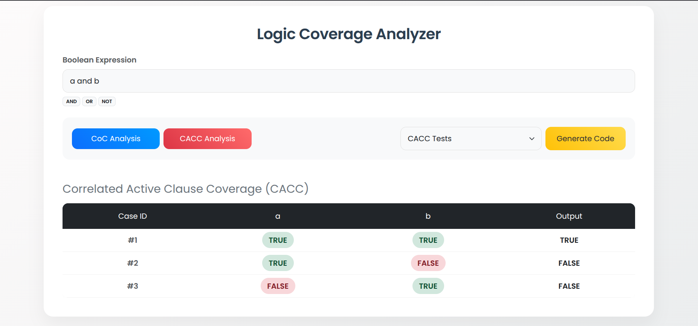

# 🧠 Logic Coverage Analyzer

[](https://www.oracle.com/java/)
[](https://spring.io/projects/spring-boot)
[](LICENSE)

A powerful full-stack tool designed for software testing. It visualizes boolean expressions, calculates **CoC** (Combinatorial Coverage) and **CACC** (Correlated Active Clause Coverage) metrics, and automatically generates optimized **JUnit 5** test cases.


*(Note: Place a screenshot of your app named `screenshot.png` in the root directory)*

## ✨ Key Features

- **📊 Combinatorial Coverage (CoC):** Generates and visualizes the full truth table for any boolean expression.
- **🎯 Correlated Active Clause Coverage (CACC):** Implements advanced algorithms to identify the *minimal* set of test cases required to prove determination.
- **☕ Auto-Generated JUnit 5 Code:** Instantly converts logic tables into ready-to-run Java test code. You can download the `.java` file directly.
- **⚡ Custom Logic Parser:** Features a custom-built recursive descent parser (Backend) to handle nested parentheses and operators without external evaluation libraries.
- **🎨 Modern UI:** A clean, responsive interface built with Bootstrap 5 and Vanilla JavaScript.

## 🛠 Tech Stack

- **Backend:** Java 17, Spring Boot 3 (Spring Web)
- **Frontend:** HTML5, CSS3, JavaScript (Fetch API), Bootstrap 5
- **Build Tool:** Maven
- **Architecture:** MVC (Model-View-Controller), Service-Oriented

## 🚀 Getting Started

Follow these steps to set up the project locally.

### Prerequisites
- JDK 17 or higher
- Maven installed

### Installation

1. **Clone the repository:**
   ```bash
   git clone https://github.com/YOUR_USERNAME/logic-analyzer.git
2.**Navigate to the project directory:**   
   ```bash
   cd logic-analyzer

   
